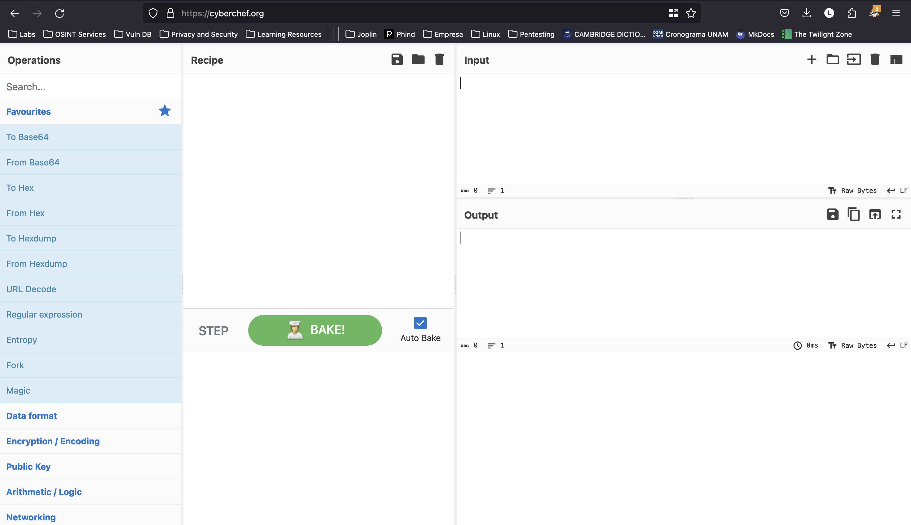

## Instrucciones

Autor del reto: Sanjay C/Danny Tunitis

**Descripción:**

Si te dijera que una palabra comienza con 0x70 en hexadecimal. ¿Cuál sería el comienzo de la palabra en ASCII?

***

## Walkthrough

1. Dirijase al sitio [cyberchef.org](https://cyberchef.org/)

    

2. Arrastre la opción "From Hex" al apartado "Recipe".

    

3. En el apartado "Input" escriba el número que queremos convertir, "0x70", en automático se generará la conversión en la sección de "Output".

    

4. La flag debe tener el siguiente formato: `picoCTF{FLAG}`.

    
