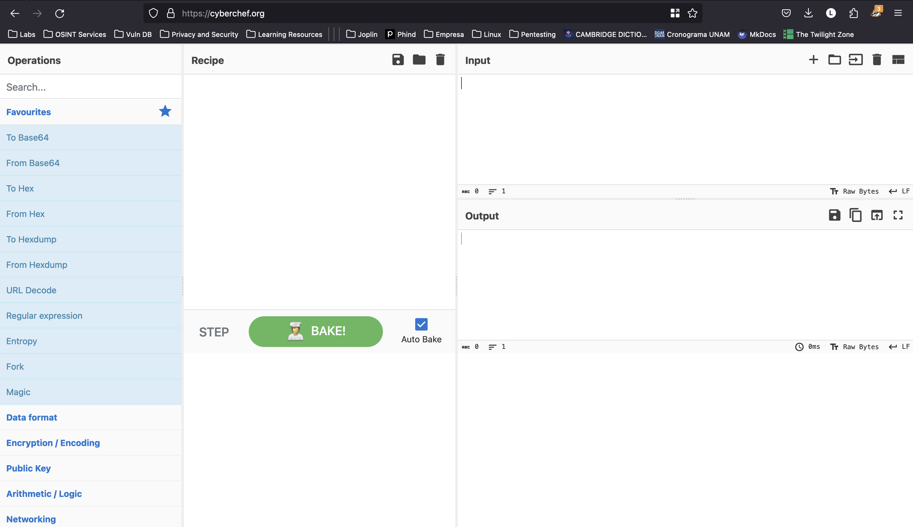
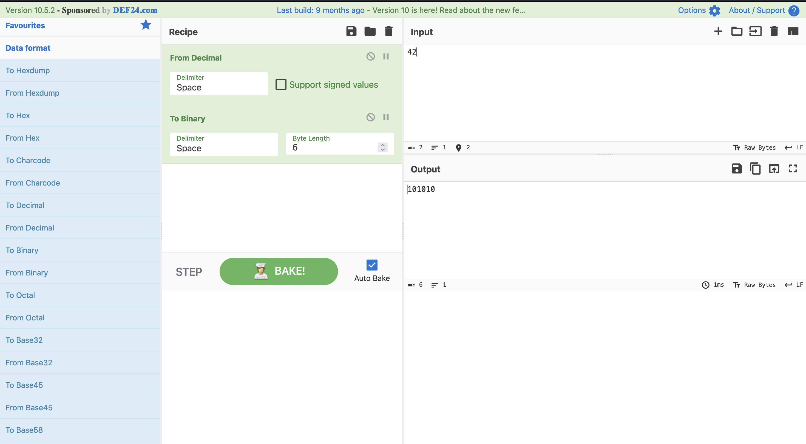

## Instrucciones

Autor del reto: Sanjay C/Danny Tunitis

**Descripción:**

¿Puedes convertir el número 42 (base 10) a binario (base 2)? 

***

## Walkthrough

1. Dirijase al sitio [cyberchef.org](https://cyberchef.org/)

    

2. Arrastre la opción "From Decimal" y después "To Binary" al apartado "Recipe".

    

    !!! tip "Tip"
        Ajusta la "Byte Lenght" a 6 de la conversión binaria, para no tener ceros a la izquierda adicionales.
        

3. En el apartado "Input" escriba el número que queremos convertir, "42", en automático se generará la conversión en la sección de "Output".

    

4. La flag debe tener el siguiente formato: `picoCTF{FLAG}`.

    
