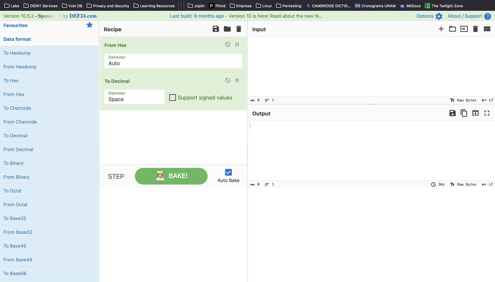
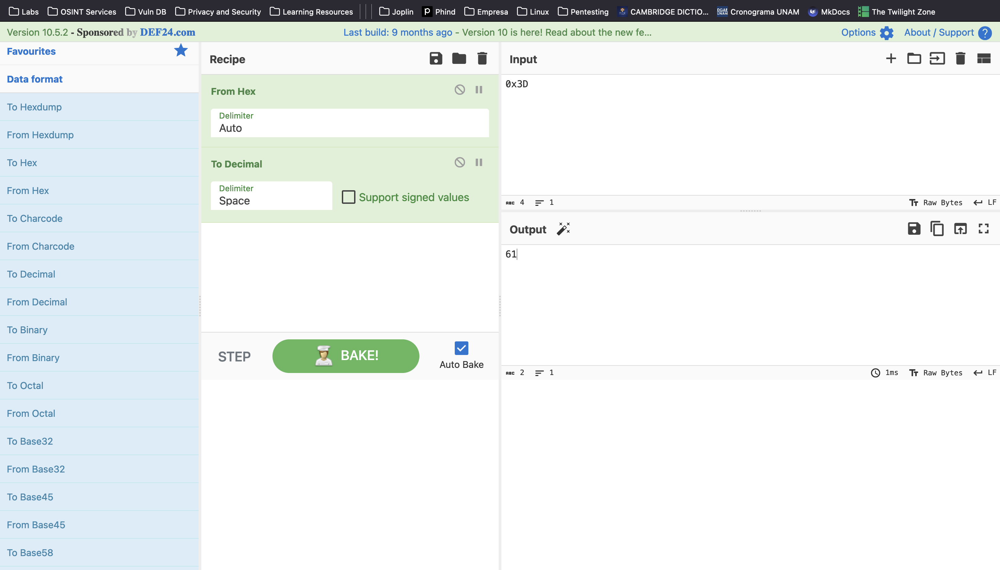

## Instrucciones

Autor del reto: Sanjay C/Danny Tunitis

**Descripción:**

¿Cuál es el valor de 0x3D (base 16) en decimal (base 10)?

***

## Walkthrough

1. Dirijase al sitio [cyberchef.org](https://cyberchef.org/)

    

2. Arrastre la opción "From Hex" y después "To Decimal" al apartado "Recipe".

    

3. En el apartado "Input" escriba el número que queremos convertir, "0x3D", en automático se generará la conversión en la sección de "Output".

    

4. La flag debe tener el siguiente formato: `picoCTF{FLAG}`.

    