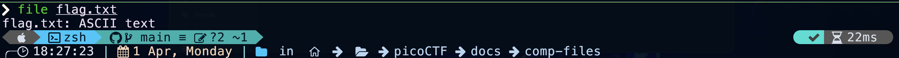
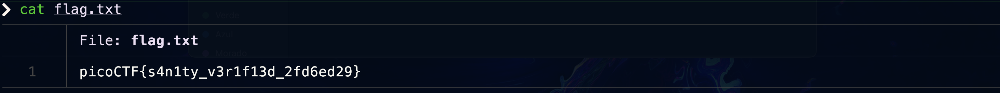

## Instrucciones

Autor del reto: Syreal


**Descripción:**

El siguiente [archivo](../comp-files/flag.txt) tiene una *flag* en texto plano (aka "in-the-clear").

***

## Walkthrough

1. Descarga el archivo indicado en las instrucciones, deberá bastar con que hagas click en la palabra "archivo".

2. Verifica el tipo de archivo que acabas de descargar.

    **Comando Sugerido**
    ```BASH
    file flag.txt
    ```

    **Ejemplo de ejecución**

    

3. Muestra el contenido del archivo. 

    **Comando Sugerido**
    ```BASH
    cat flag.txt
    ```

    **Ejemplo de ejecución**

    

4. Envío de flag en plataforma
    
    
    

