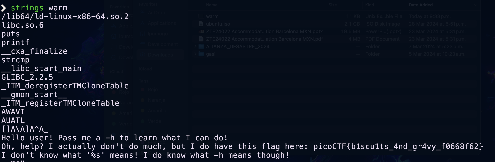

## Instrucciones

Autor del reto: Syreal


**Descripción:**

¿Puedes invocar las banderas de ayuda de una herramienta o binario? Este [programa](../comp-files/warm) tiene información extraordinariamente útil...

***

## Walkthrough

1. Descarga el archivo indicado en las instrucciones, deberá bastar con que hagas click en la palabra "programa".

    

2. Abre tu terminal y dirigete a la carpeta de "Descargas", generalmente funciona el siguiente comando:

    ```BASH
    cd ~/Downloads
    ```

3. El archivo se debe llamar "warm", y debe ser un binario, no podemos ver el código fuente de los binarios, sin embargo, mediante el siguiente comando podemos ver las cadenas de texto incrustradas en él.

    !!! danger "Peligro"
        La ejecución de binarios desconocidos es muy peligrosa, te recomendamos que siempre intentes ejecutar programas de fuentes confiables y en entornos de pruebas, no en tu máquina directamente. 

    ```BASH
    strings warm
    ```
    

4. Si leemos el output del comando encontraremos una nota que nos comenta que las banderas de ayuda se suelen invocar con el parámetro `-h` y muy cerca encontraremos la flag. 

    
