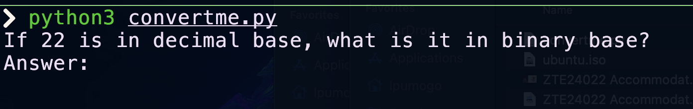
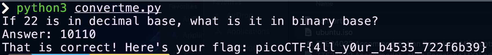

## Instrucciones

Autor del reto: LT 'syreal' Jones


**Descripción:**

Corre el script de Python y convierte el número dado de decimal a binario para obtener la flag. 

[Descarga el script de Python](../comp-files/convertme.py) 
***

## Walkthrough

1. Descarga el archivo indicado en las instrucciones, deberá bastar con que hagas click en la frase "Descarga el script de Python".

    

2. Antes de ejecutar el script, procura leer el contenido para asegurarte que no haya ninguna amenaza para tu equipo.

    ```python3
    import random


    def str_xor(secret, key):
        #extend key to secret length
        new_key = key
        i = 0
        while len(new_key) < len(secret):
            new_key = new_key + key[i]
            i = (i + 1) % len(key)        
        return "".join([chr(ord(secret_c) ^ ord(new_key_c)) for (secret_c,new_key_c) in zip(secret,new_key)])


    flag_enc = chr(0x15) + chr(0x07) + chr(0x08) + chr(0x06) + chr(0x27) + chr(0x21) + chr(0x23) + chr(0x15) + chr(0x5f) + chr(0x05) + chr(0x08) + chr(0x2a) + chr(0x1c) + chr(0x5e) + chr(0x1e) + chr(0x1b) + chr(0x3b) + chr(0x17) + chr(0x51) + chr(0x5b) + chr(0x58) + chr(0x5c) + chr(0x3b) + chr(0x42) + chr(0x57) + chr(0x5c) + chr(0x0d) + chr(0x5f) + chr(0x06) + chr(0x46) + chr(0x5c) + chr(0x13)


    num = random.choice(range(10,101))

    print('If ' + str(num) + ' is in decimal base, what is it in binary base?')

    ans = input('Answer: ')

    try:
    ans_num = int(ans, base=2)
    
    if ans_num == num:
        flag = str_xor(flag_enc, 'enkidu')
        print('That is correct! Here\'s your flag: ' + flag)
    else:
        print(str(ans_num) + ' and ' + str(num) + ' are not equal.')
    
    except ValueError:
    print('That isn\'t a binary number. Binary numbers contain only 1\'s and 0\'s')
    ```
3. Después de verificar el accionar del script, ejecutalo con el siguiente comando:

    ```BASH
    python3 convertme.py
    ```
    

4. El programa nos pedirá ingresar la conversión de 22 base 10 a binario, un proceso de conversión análogo se puede ver [aquí](02_2Warm.md)

    El valor es: `10110`

    Después de ingresarlo, obtendremos la flag. 

    


    