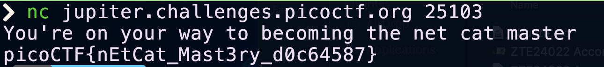

## Instrucciones

Autor del reto: Sanjay C/Danny Tunitis


**Descripción:**

Usar `netcat` (`nc`) será bastante importante. 

¿Puedes conectarte a [jupiter.challenges.picoctf.org](https://jupiter.challenges.picoctf.org) en el puerto 25103 para obtener la flag?


***

## Walkthrough

1. Abra su terminal y ejecute el siguiente comando:

    ```BASH
    nc jupiter.challenges.picoctf.org 25103
    ```

2. Obtendrá de inmediato la flag como respuesta.

    


    